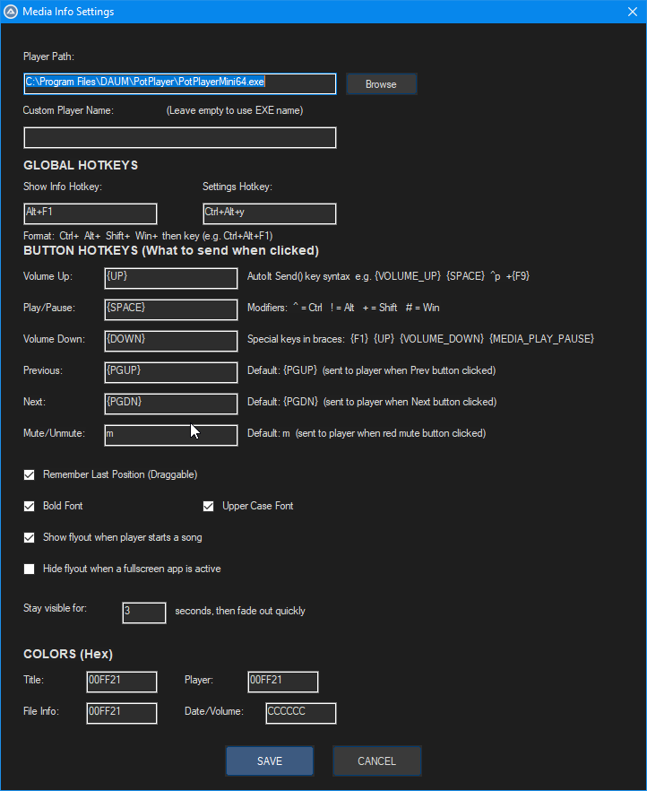
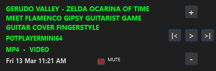
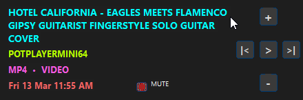
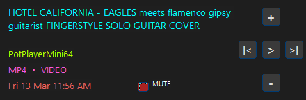
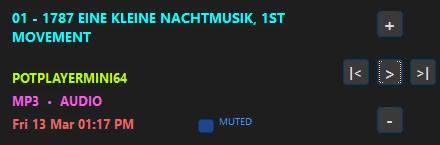

# 🌳🌹 Simple Universal Media Info 🌹🌳

> A lightweight always-on-top media info flyout overlay for Windows, built with AutoIt.

---

🎧 Simple Universal Media Info FEATURES

___

## ⚙️ FLYOUT SETTING

___

## 🌞 FLYOUT 01 (Green Text/Bold/Uppercase)

___

## 💎 FLYOUT 02 (Colorfull/Bold/Uppercase)

___

## 🌿 FLYOUT 03 (Colorfull/Normal Text/Uppercase)

___

## 🌹 FLYOUT 04 (Muted)

___

## 📽️ Watch Demo Here

___

## 📦 Files

| File | Description |
|---|---|
| `Simple_Universal_Media_Info_Fixed.au3` | AutoIt source code |
| `Simple_Universal_Media_Info_Fixed_x64.exe` | Compiled 64-bit executable |
| `Simple_Universal_Media_Info_Fixed_x86.exe` | Compiled 32-bit executable |
| `Simple_Universal_Media_Info_Fixed_x64.rar` | Archived 64-bit build |
| `Simple_Universal_Media_Info_Fixed_x86.rar` | Archived 32-bit build |
| `Simple_Universal_Media_Info_Fixed_Source_Code.rar` | Archived source code |

---

## ⚠️ First Launch Notice

After launching for the first time, the flyout GUI may **not be fully rendered** on the very first hotkey press.

**Fix:** Toggle the flyout once (show → hide) using the hotkey, and it will work correctly every time afterwards.

The same applies after **saving settings** — perform one show/hide toggle to refresh and apply your changes to the flyout.

---

## 🖱️ Button Notice

Clicking any control button on the flyout (volume, play/pause, previous, next, mute) will **briefly bring the player window to the foreground** to send the keystroke, then return focus. This means if your player is minimized, **it will pop up momentarily**. Simply minimize it again afterwards — this is a Windows limitation of the key-sending method.

---

## 🖥️ What It Does

Simple Universal Media Info monitors a configured media player process in the background and displays a compact dark overlay with live information. The flyout appears, stays visible for a configurable delay, then fades out smoothly. Hovering the mouse over it pauses the fade timer.

The flyout displays the following information:

- 🎬 **Title** — filename of the currently playing file (without extension)
- 🎧 **Player** — detected or custom-named media player
- 📄 **File Info** — file extension and media type, e.g. `MKV  •  VIDEO` or `MP3  •  AUDIO`
- 🕒 **Date & Time** — live clock, updates in real time while the flyout is visible, e.g. `Wed 11 Mar 08:53 PM`
- 🔇 **Mute indicator** — color-coded button and label (red = unmuted, blue = muted)

---

## 🎮 Flyout Media Controls

Six buttons on the right side of the flyout send configurable keystrokes directly to the player window. All buttons are remappable from the Settings panel.

| Button | Action | Default Key Sent |
|---|---|---|
| `+` | Volume Up | `{VOLUME_UP}` |
| `\|<` | Previous Track | `{PGUP}` |
| `>` / `\|\|` | Play / Pause (toggles) | `{MEDIA_PLAY_PAUSE}` |
| `>\|` | Next Track | `{PGDN}` |
| `-` | Volume Down | `{VOLUME_DOWN}` |
| `MUTE` | Mute / Unmute toggle | `m` |

---

## ⌨️ Default Global Hotkeys

| Hotkey | Action |
|---|---|
| `Alt + F1` | Toggle show / hide the media info flyout |
| `Ctrl + Alt + Y` | Open the Settings panel |

Both hotkeys are fully customizable from the Settings panel.

---

## ⚙️ Settings Panel

Open via **tray icon → Settings** or the settings hotkey (`Ctrl+Alt+Y` by default).

> ⚠️ After saving settings, toggle the flyout once (show → hide) to apply your changes.

---

### 🗂️ Player Configuration

**Player Path**
Full path to your media player executable. Use the **Browse** button to locate it. The script monitors this process by name and reads its window title to extract the currently playing filename.
Default: `C:\Program Files\DAUM\PotPlayer\PotPlayerMini64.exe`

**Custom Player Name**
An optional display name shown in the flyout instead of the raw `.exe` name. Leave empty to use the executable name automatically (without `.exe`).

---

### 🌐 Global Hotkeys

**Show Info Hotkey**
The hotkey to toggle the flyout on/off. Enter in human-readable format: `Alt+F1`, `Ctrl+Alt+Z`, `Shift+Win+M`, etc.

**Settings Hotkey**
The hotkey to open the Settings panel directly. Same format as above.

> Format: use `Ctrl+` `Alt+` `Shift+` `Win+` followed by the key name. Example: `Ctrl+Alt+F1`, `Alt+Z`.

---

### 🎛️ Button Hotkeys

Each flyout button sends a configurable keystroke to the player window when clicked, using **AutoIt Send() syntax**.

| Button | Default | Notes |
|---|---|---|
| Volume Up | `{VOLUME_UP}` | Media key |
| Play/Pause | `{MEDIA_PLAY_PAUSE}` | Media key |
| Volume Down | `{VOLUME_DOWN}` | Media key |
| Previous | `{PGUP}` | Sent to player window |
| Next | `{PGDN}` | Sent to player window |
| Mute/Unmute | `m` | Sent to player window |

**Syntax reference:**
- Special keys in braces: `{F1}` `{UP}` `{VOLUME_DOWN}` `{MEDIA_PLAY_PAUSE}` `{PGUP}` `{SPACE}`
- Modifier prefixes: `^` = Ctrl, `!` = Alt, `+` = Shift, `#` = Win
- Combined examples: `^p` = Ctrl+P, `+{F9}` = Shift+F9

---

### ✅ Behaviour Options

**Remember Last Position (Draggable)**
Saves the flyout's screen position on exit and restores it on the next launch. The flyout is always draggable by clicking and dragging anywhere on it.

**Bold Font**
Renders all flyout text labels in bold weight.

**Upper Case Font**
Forces all flyout text (title, player name, file type) to display in uppercase.

**Show flyout when player starts a song**
Automatically pops up the flyout whenever a new media file starts playing in the configured player.

**Hide flyout when a fullscreen app is active**
The flyout will not appear (or will immediately hide itself) if a fullscreen application has focus — useful for gaming or fullscreen video. When disabled, the flyout forces itself above all windows including fullscreen apps.

**Stay visible for N seconds, then fade out**
How long the flyout stays fully visible before fading out over ~500ms. Hovering the mouse over the flyout pauses and resets this timer.

---

### 🎨 Colors (Hex)

Customize the text color of each flyout element using standard 6-digit hex color codes (no `#` prefix needed).

| Field | Default | Description |
|---|---|---|
| Title | `FFFFFF` | Media filename text |
| Player | `CCCCCC` | Player name label |
| File Info | `AAAAAA` | File type and media type row |
| Date/Volume | `CCCCCC` | Live date and time row |

---

## 🖱️ Tray Icon

The script runs silently in the system tray with no taskbar entry. Right-click to access:

- **Settings** — opens the full settings panel
- **Exit** — saves all settings and exits cleanly

---

## 📋 Requirements

- Windows 7 or later
- A media player that shows the filename in its window title (e.g. PotPlayer, MPC-HC, VLC, foobar2000)
- AutoIt v3 to run the `.au3` source directly — the pre-compiled `.exe` builds have no dependencies

---

## 🔧 Supported Media Formats

**Video:** `mp4` `mkv` `avi` `mov` `m4v` `flv` `wmv` `webm` `mpg` `mpeg` `ts` `m2ts`

**Audio:** `mp3` `flac` `wav` `ogg` `m4a` `wma` `aac`

---

## 📁 Settings Storage

All settings are saved automatically to an `.ini` file located alongside the script/executable. Settings are loaded on startup and saved on exit or when clicking **SAVE** in the settings panel.

---

## 📜 License

**Open-source — Non-commercial use only.**
© AndrianAngel 2026. All rights reserved for commercial use.
Free to use, modify, and share for personal and non-commercial purposes.
